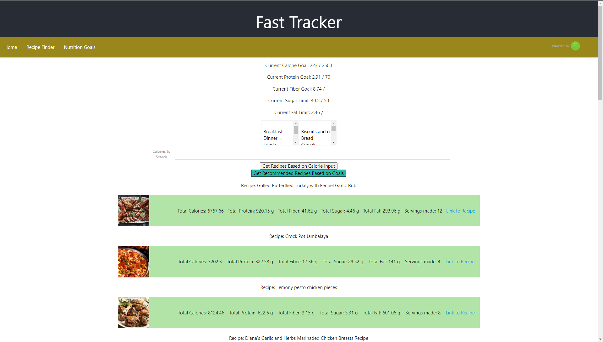

  
# Health-Tracker

## Description
This project was built for tracking eating as well as nutrition goals and suggesting recipes based on that data. Users can search through a database of foods to add what they've eaten, list their nutrition goals, and then perform a search based off of some criteria or based on how far they are from the current goal listed. My motivation for this project was to create an easy way to track your nutrition goals and stick to it in as simple a manner as possible to create a user experience that is actually helpful rather than detrimental due to significant work. This project was designed to work for users, not the other way around. It is also a react application and is planned to become a full stack application. This project also makes significant use of React hooks as well as CSS and functional components. In total, it currently makes calls to 3 different APIs, however there are plans to add a fourth. Many issues had to be overcome, and a significant amount of render control had to be put in to place to render local variables and update the virtual DOM accordingly.

# Table of Contents
- [Installation](#Installation)
- [Description](#Description)
- [Usage](#Usage)
- [What-I-learned](#What-I-Learned)
- [Tests](#Tests)
- [Screenshot-of-Application](#Screenshot-of-Application)
- [Links](#Links)
- [Questions?](#Questions?)
- [License](#License)

## Installation
Currently to run this project you will need to clone the repository, make sure to npm i to install the dependencies, and correctly fill you .env file with valid RapidAPI and Edamam keys and ids. This section will be updated once a database has been implemented and the project is prepared for a web launch

## Usage
This Project is used for searching the Edamam food and grocery database to create a list of foods eaten in the day, tracking various nutritional goals, and using the data from the list and goals in order to run a much more robust and helpful search through the Edamam Recipe database for meals to complete nutritional goals. Users may search for various foods using natural language processing and add various searches to their food list. Users may also add custom goals for various nutritional areas, such as calories or protein. Using this data or custom data, users may also search for recipes that match or are close to multiple features.

## What I Learned
I learned precise use of the useEffect hook and timely use of the useState hook in order to precisely control rerenders and API calls as the APIs being used have a call limit, leading me to need significant efficiency when making calls. I also learned multiple input styles and ensuring that the internal variables updated for user input before attempting to use the data, creating multiple chains of code in the process to ensure that code was executed in the proper order. This was also my first use of local variables, as such I learned a lot about their requirements and syntax, such as converting objects to JSON and parsing the data once I needed to use the stored object. The following is an example of fetching an array of objects from local storage:

    const calGoalMath = () => {
        if(localStorage.getItem("foodList")){
            const storedList = JSON.parse(localStorage.getItem("foodList"));
            let total = 0;
            let diff = 0;
            storedList.map((item) => {
                total += item.calories;
            });
            setCalCurrent(total);
            diff = calGoal - total;
            if (diff <= 0) {
                return 0;
            } else {
                return diff;
            }
        } else {return 0;}
    };

## Tests
There are no current tests for this application

## Screenshot of Application

## Links
[Github page for Health-Tracker](https://github.com/Alovold/health-tracker)

## Questions?
My gitHub user name is ALovold, and you may email me at austin@lovolds.com for Questions.
You may contribute to this project by please emailing me with feedback!.

## License
MIT